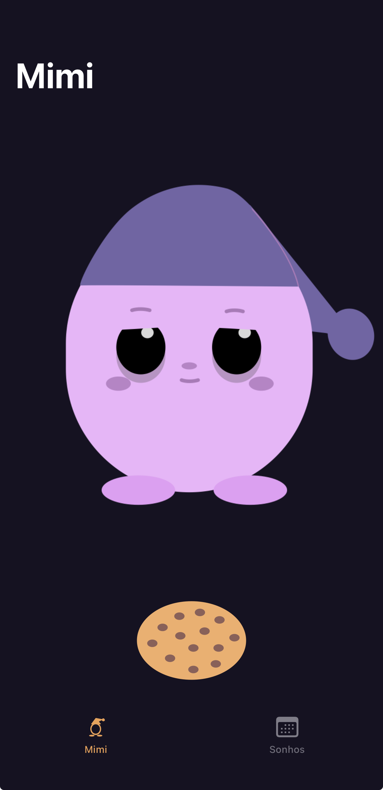
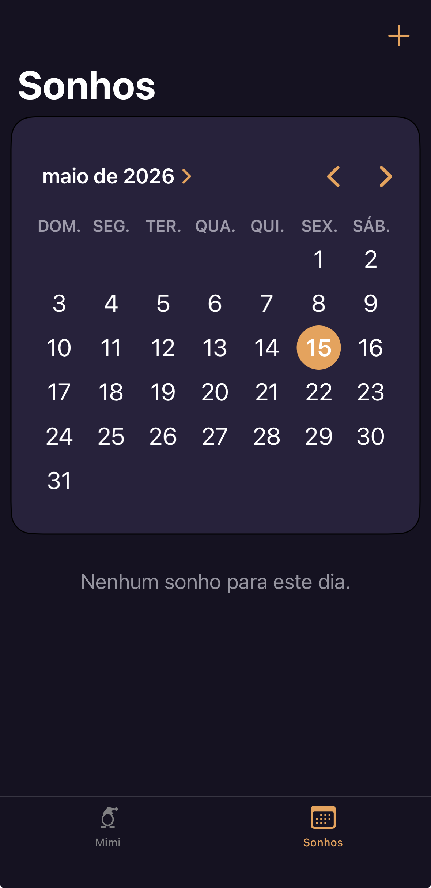
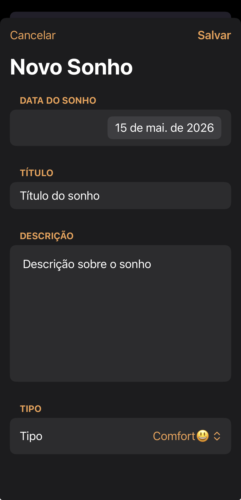
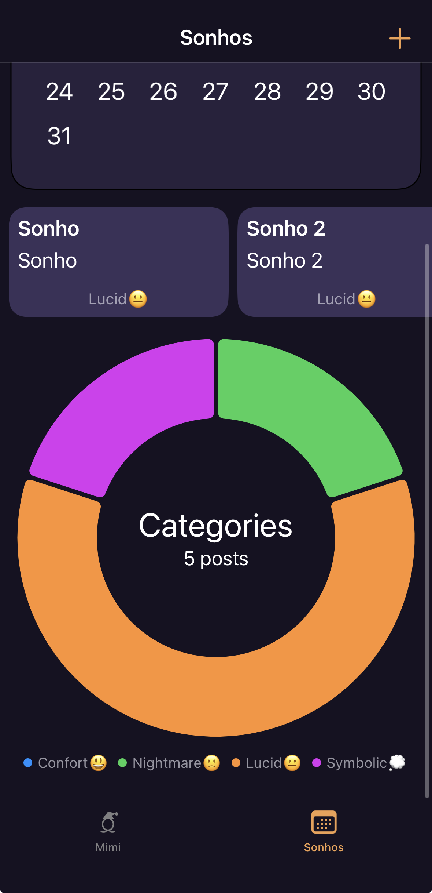
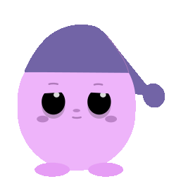

<div align="center">


# MimiDreams

### Your cozy dream journal, guarded by a sleepy little companion. 🌙

Write down your dreams, watch them bloom on a calendar, and feed **Mimi** —
your pixel companion who happily munches a cookie every time you log a new dream.

<br/>

[](https://www.apple.com/ios/)
[](https://swift.org)
[](https://developer.apple.com/xcode/swiftui/)
[](https://developer.apple.com/documentation/coredata)
[](LICENSE)

<br/>

<a href="https://apps.apple.com/br/app/mimi-dreams/id6747144355">
  
</a>

</div>

---

## 📑 Table of Contents

- [About](#-about)
- [Features](#-features)
- [Screenshots](#-screenshots)
- [Tech Stack](#-tech-stack)
- [Project Structure](#-project-structure)
- [Getting Started](#-getting-started)
- [Team](#-team)
- [License](#-license)

---

## ✨ About

**MimiDreams** is a SwiftUI iOS app that turns dream journaling into a small daily
ritual. Every dream you record is stored locally with **Core Data**, categorized,
and visualized — so over time you can actually *see* the shape of your sleep.

And because journaling should feel rewarding, every entry feeds **Mimi**: a
frame-by-frame animated mascot that nibbles a cookie as a little thank-you. 🍪

---

## 🚀 Features

| | |
|---|---|
| 🍪 **Animated mascot** | Mimi reacts to your activity with a 42-frame hand-drawn eating animation. |
| 📝 **Dream journaling** | Capture a title, the full dream text, and a mood/type for every entry. |
| 🗂️ **Dream types** | Tag each dream as `Comfort 😃`, `Nightmare 🙁`, `Lucid 😐` or `Symbolic 💭`. |
| 📅 **Calendar view** | Browse your nights on an interactive calendar and revisit past dreams. |
| 📊 **Insights chart** | An interactive pie chart breaks down your dreams by category. |
| 💾 **Offline-first** | 100% local persistence with Core Data — no account, no cloud, fully private. |

---

## 📱 Screenshots

| Mimi | Calendar | Add Dream | Insights |
|:---:|:---:|:---:|:---:|
|  |  |  |  |

---

## 🛠️ Tech Stack

- **Language:** Swift 5
- **UI:** SwiftUI + [Swift Charts](https://developer.apple.com/documentation/charts)
- **Persistence:** Core Data
- **Minimum target:** iOS 18.5
- **Architecture:** MVVM-ish — declarative views over a Core Data store, with a
  shared `PersistenceController` singleton.

---

## 📂 Project Structure

```
MimiDreams/
├── MimiDreamsApp.swift        # App entry point, injects the Core Data context
├── ContentView.swift          # Root TabView (Mimi · Dreams)
├── MimiView.swift             # Animated mascot + cookie animation logic
├── CalendarView.swift         # Calendar + horizontal list of dreams
├── AddDreamView.swift         # Create / edit a dream entry
├── DreamCardView.swift        # Reusable dream summary card
├── ChartView.swift            # Interactive pie chart of dream categories
├── Persistence.swift          # Core Data stack (PersistenceController)
├── CoreDataExtentions.swift   # Safe-save helpers for NSManagedObjectContext
├── Assets.xcassets            # Mascot frames, icons, color palette
└── MimiDreams.xcdatamodeld    # Core Data model (Item: title, dreamText, type, timestamp)
```

---

## 🧑‍💻 Getting Started

**Requirements:** macOS with Xcode 16+ and an iOS 18.5 simulator or device.

```bash
git clone https://github.com/EnzoFerroni/MIMI.git
cd MIMI
open MimiDreams.xcodeproj
```

Then hit **⌘R** in Xcode to build and run. No external dependencies — it just works.

---

## 👥 Team

<div align="center">

Built with care by:

<table>
  <tr>
    <td align="center" width="25%">
      <a href="https://github.com/Alana-Abdias"></a>
      <br/><sub><b>Alana Abdias</b></sub><br/><br/>
      <a href="https://github.com/Alana-Abdias"></a>
      <a href="https://www.linkedin.com/in/alana-abdias-de-oliveira-macedo-585b11359/"></a>
    </td>
    <td align="center" width="25%">
      <a href="https://github.com/EnzoFerroni"></a>
      <br/><sub><b>Enzo Ferroni</b></sub><br/><br/>
      <a href="https://github.com/EnzoFerroni"></a>
      <a href="https://www.linkedin.com/in/enzoferroni/"></a>
    </td>
    <td align="center" width="25%">
      <a href="https://github.com/LuccaPV"></a>
      <br/><sub><b>Lucca Pivoto</b></sub><br/><br/>
      <a href="https://github.com/LuccaPV"></a>
      <a href="https://www.linkedin.com/in/luccapivoto/"></a>
    </td>
    <td align="center" width="25%">
      
      <br/><sub><b>Mimi</b></sub><br/><br/>
      
      
    </td>
  </tr>
</table>

</div>

---

## 📄 License

Released under the [MIT License](LICENSE). © 2025 Alana Abdias, Enzo Ferroni and Lucca Pivoto.

<div align="center">
<br/>
<sub>Made with 💤 and a lot of cookies.</sub>
</div>
